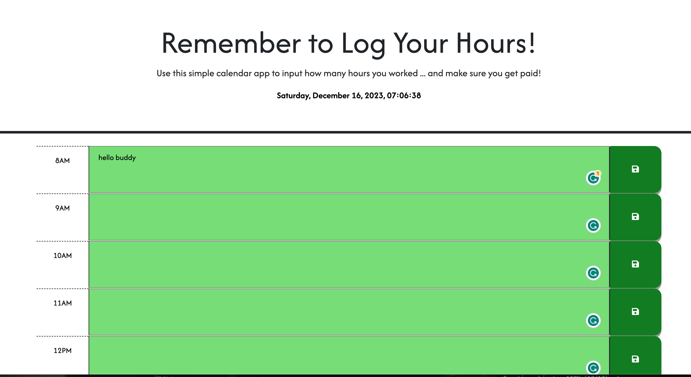
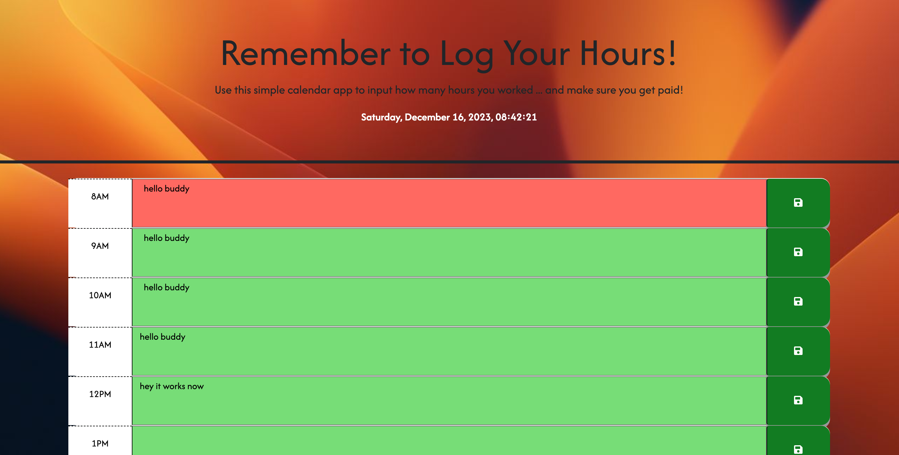

# Third-Party APIs Challenge // Work Schedule App

##### _Languages & Tools Used_ 🛠

#### _Links_
* <a href="https://github.com/F3N215/scheduler-challenge/blob/main/Develop/index.html">HTML</a>
* <a href="https://github.com/F3N215/scheduler-challenge/blob/main/Develop/assets/css/style.css">CSS</a>
* <a href="https://github.com/F3N215/scheduler-challenge/blob/main/Develop/assets/js/script.js">JS</a>

-----
## Project Summary 📋
* Using some basic starter code, I was tasked to create a simple calendar application that lets a user save events for each hour of a typical work day
* The browser app was to feature dynamically updated HTML and CSS using jQuery and Day.js library to handle dates and times
* When inputs are made and the saved button is clicked, the application stores information in local browser storage that persists on refresh
* Hours are colour-coded to past, present, future accordingly
-----
# Initial Work & Study 💻
 
* Searched through previous classes and online tutorials on functions, Day.js integration and jQuery
* Goal: to understand integration of third-party APIs and how it is properly called using JS

# Collaboration Workflow 🦾
* Reviewed some of my work with my mentor which helped finalized the flow of my JS logic 
* Multiple requests for information & details from Xpert Learning Assistant 
* Completed tutoring session requesting additional explanations and assistance regarding memory persistence issue and conditional formatting 
-----
## Summary of Changes 📝

* Starting with updates to the HTML to align for time blocks, I switched over to JavaScript to start addressing logic
* Worked through developing the trackHours function to pull # of hours and update the HTML class using day.js 
* Slowly worked through logic to pull the element id and show only the hour 
* Worked out ‘if, else if’ statements to replace time block element ids with past, present or future
* Cleaned up HTML to allow for dynamic changes
* Changed font styles using Google Fonts, and updated save button stylings to give them more of a “punch down” effect
* Added media queries for correct sizing on mobile
* Tested ‘sunrise’ colour pallet for gradient and changed to background image instead
-----

## Screenshots 📸
* 
* 

-----
## About Me
<h3 align="left">Hey there! I'm Dan 👋 I'm a junior fullstack webdev</h3>

* 🔭 I’m currently working on occult projects, SMBs & personal pages
* 🌱 I’m currently learning HTML5, CSS, & JavaScript
* 📫 Email me **dcampo85@gmail.com**

<h6 align="left">Connect with me:</h6>

